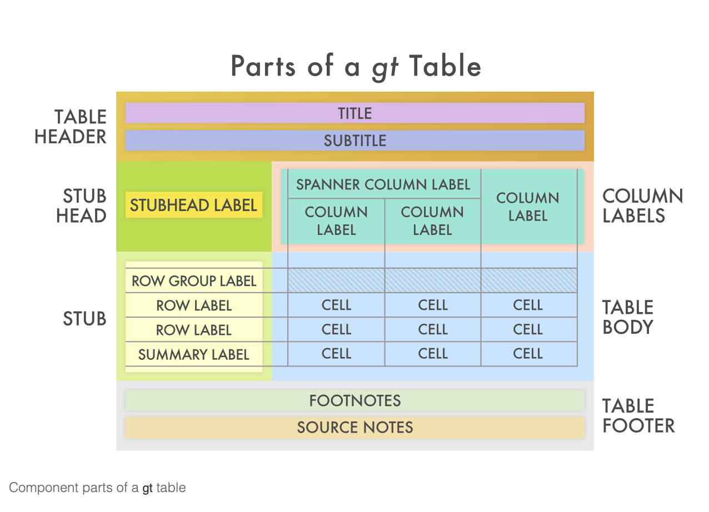

<!-- Make consistent the table over time, i.e., not **Enos** and then no **. Although if you want to just, for one example, show something and then go back, that is good to. -->

<!-- Save md() for having a column named $Y_i$. Or maybe for header span. See Chapter 3. -->

# Introduction

gt is a simple way to elegantly display your data and any summaries of your data. By now you're familiar with ggplot, another great way to display and summarize data. However, in many instances, tables are a more appropriate way to showcase data, especially when you need to provide exact figures in an easy-to-access format. 

First, we'll create a gt summary table of some observations from the data. Second, we'll runs a linear regression and display the outcome using gtsummary.

## Loading Libraries and Data

Here are the libraries needed to create gt and gtsummary tables:

```{r setup, include=FALSE}
library(tidyverse)
library(broom.mixed)
library(gt)
library(PPBDS.data)
```

# Building gt Table

Now let's pull some data which we will use in our table: 

```{r}
x <- trains %>%
  select(gender, income, att_end) %>%
  slice(1:5)
x
```

This is what the most basic `gt()` table will look like:

```{r basic gt}
x %>% 
  gt()
```

Now let's make this more professional. Gt offers a variety of functions to add features like these: 

```{r, echo=FALSE}

```

You can add a title and subtitle using the function `tab_header()`: 

```{r}
x %>% 
  gt()%>%
   tab_header(title = "Enos Data Observations", 
              subtitle = "Gender, Income, and End Attitude from the Trains Data")
```

By default, titles and other text can not be formatted. If you want formatting, you must wrap the character string in a call to `md()`, where *md* stands for (M)ark(d)own. For example, here is a bolded title.

```{r}
x %>% 
  gt()%>%
   tab_header(title = md("**Enos Data Observations**"), 
              subtitle = "Gender, Income, and End Attitude from the Trains Data")
```

You can neaten up the column names using `cols_label()`:

```{r}
x %>% 
  gt()%>%
   tab_header(title = md("**Enos Data Observations**"), 
              subtitle = "Gender, Income, and End Attitude from the Trains Data")%>%
  cols_label(gender = "Gender",
             income = "Income", 
             att_end = "End Attitude")
```

Use a `tab_source_note()` to cite the source of the data or to create a caption:

```{r}
x %>% 
  gt()%>%
   tab_header(title = md("**Enos Data Observations**"), 
              subtitle = "Gender, Income, and End Attitude from the Trains Data") %>%
  cols_label(gender = "Gender",
             income = "Income", 
             att_end = "End Attitude") %>% 
  tab_source_note("Source: Ryan Enos")
```
Using `md()` again, we can italicize the name of the Enos study in the caption:
```{r}
x %>% 
  gt()%>%
   tab_header(title = md("**Enos Data Observations**"), 
              subtitle = "Gender, Income, and End Attitude from the Trains Data") %>%
  cols_label(gender = "Gender",
             income = "Income", 
             att_end = "End Attitude") %>% 
  tab_source_note(md("Source: Ryan Enos, *Causal Effect of Intergroup Contact on Exclusionary Attitudes*"))
```


Now that the table structure looks good, we want to fix the contents. Let's add some dollar signs to the income column using `fmt_currency()`. This function also adds commas (if you want commas without dollar signs use `fmt_number()`):

```{r}
x %>% 
  gt()%>%
   tab_header(title = md("**Enos Data Observations**"), 
              subtitle = "Gender, Income, and End Attitude from the Trains Data")%>%
  cols_label(
    gender = "Gender",
    income = "Income", 
    att_end = "End Attitude") %>% 
  tab_source_note(md("Source: Ryan Enos, *Causal Effect of Intergroup Contact on Exclusionary Attitudes*")) %>%
  fmt_currency(columns = vars(income), 
               decimals = 0) 
```

WASN'T ABLE TO CHANGE FONTS 


## Example 2: Using gt to Display Regression Results 
There are a few ways to visualize regression results. The most basic way is using `print()`. Here is the result of a linear regression with `lm()` using party to describe end attitude:

```{r}
fit1 <- lm(att_end ~ party, data = trains)
print(fit1)
```
This gives us the info we need but doesn't look very nice. We can use *gtsummary* to create more professional visualizations. Put the regression into `tbl_regression()`:
```{r regression}

library(gtsummary)

tbl_regression(fit1)


# note for Carine: democrats (intercept) have attitude of 8.78 and Republicans' atts increase by 2.17


```

The table above is pretty basic: it only shows the coefficient for Republicans. But what about the intercept, Democrats? `tbl_regression()` with intercept = TRUE displays the intercept value:
```{r}
# to see intercept
tbl_regression(fit1, intercept = TRUE)

```


It would be nice to have a column for each party. We can do this using `tbl_summary()`:
BY = TRT and TITLES NOT WORKING 
https://github.com/ddsjoberg/gtsummary

To add titles, captions, and the like, we need to transform this graphic into a gt object using `as_gt()`:
```{r}
tbl_regression(fit1, intercept = TRUE) %>%
  as_gt()
```

Now we can add a title and subtitle using `tab_header()` just as we did with the gt table in example 1:
```{r}
tbl_regression(fit1, intercept = TRUE) %>%
  as_gt() %>%
  tab_header(title = "Regression of Attitudes about Immigration", 
              subtitle = "The Effect of Party on End Attitude")
  
```

Now we can ad a caption:
```{r}
tbl_regression(fit1, intercept = TRUE) %>%
  as_gt() %>%
  tab_header(title = "Regression of Attitudes about Immigration", 
              subtitle = "The Effect of Party on End Attitude") %>%
  tab_source_note(md("Source: Ryan Enos, *Causal Effect of Intergroup Contact on Exclusionary Attitudes*"))
```


We can making a gt table using a `stan_glm()` regression as well:
```{r}
library(rstanarm)

fit2 <- stan_glm(att_end ~ party, data = trains, refresh = 0)

tbl_regression(fit2, intercept = TRUE) %>%
  as_gt() %>%
  tab_header(title = "Regression of Attitudes about Immigration", 
              subtitle = "The Effect of Party on End Attitude") %>%
  tab_source_note(md("Source: Ryan Enos, *Causal Effect of Intergroup Contact on Exclusionary Attitudes*"))
  
```


- now add title, caption, etc - take stuff above and apply 


# Sources:
https://themockup.blog/posts/2020-05-16-gt-a-grammer-of-tables/

footnote: 
Mock (2020, May 18). The Mockup Blog: gt - a (G)rammar of (T)ables. Retrieved from https://themockup.blog/posts/2020-05-16-gt-a-grammer-of-tables/

BibTeX citation: 
@misc{mock2020gt,
  author = {Mock, Thomas},
  title = {The Mockup Blog: gt - a (G)rammar of (T)ables},
  url = {https://themockup.blog/posts/2020-05-16-gt-a-grammer-of-tables/},
  year = {2020}


Notes 
- make it look how you want in book
- always bold r package in backticks, backticks with parentheses for function
- save md for end yi, xi for gender and income 
    - spanner for them 
- italicize name of study in caption of enos 2014 
- attiudes toward immigration as title 
- no color 
- laast few lines about other options, see LINKS
- att end on gender 

